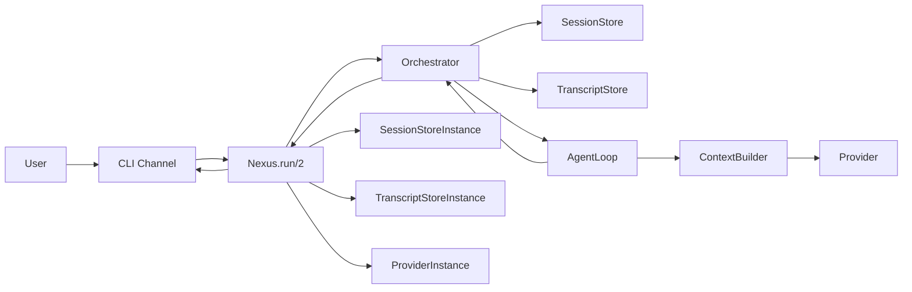

# Nexus

Nexus is an Elixir/OTP agent framework designed to be extensible, observable,
and easy to learn from while it is being built.

The project is currently in the first implementation phase:

- architecture and terminology are being stabilized
- a minimal end-to-end synchronous runtime path exists
- the next goal is the first real tool round through the agent loop

## Current Status

The repository currently includes:

- a bootable OTP application
- a passing test suite
- a minimal runtime path with:
  - `CLI Channel`
  - `Orchestrator`
  - `AgentLoop`
  - `ContextBuilder`
  - `FakeProvider`
  - `AnthropicProvider` (minimal, non-streaming)
  - `OpenAICompatibleProvider` (minimal, chat-completions based)
  - in-memory `SessionStore`
  - in-memory `TranscriptStore`
  - file-backed `SessionStore`
  - file-backed `TranscriptStore`
  - a minimal `Tool` boundary
  - a first built-in tool: `CurrentTime`
  - a structured provider boundary with `Provider.Request` and typed `Provider.Result.*`
  - runtime-configured tools flowing into provider requests
- architecture notes and implementation plans
- project rules for step-by-step learning
- architecture diagrams for the current structure and flow

## Architecture At A Glance



## How One Turn Works

1. A channel normalizes external input into `Message.Inbound`.
2. `Nexus.run/2` resolves `ProviderInstance`, `SessionStoreInstance`, `TranscriptStoreInstance`, and configured tools from runtime configuration.
3. The `Orchestrator` resolves or creates the session.
4. The inbound user message is persisted in the transcript.
5. The `AgentLoop` receives the current session transcript.
6. The `ContextBuilder` turns the transcript into `Message.LLM[]`.
7. The `AgentLoop` wraps those messages plus the available tool definitions in `Provider.Request`.
8. The provider adapter returns `Provider.Result.Text` or `Provider.Result.ToolRequest`.
9. The `Orchestrator` persists the new transcript messages and builds `Message.Outbound`.

Provider-specific configuration is expected to come from external runtime
configuration, not from the provider adapter itself.

Tool configuration is now split into two sources:

- `system_tools`
  tools made available by the harness itself through app config
- `tools`
  tools explicitly added through runtime JSON config

At this stage, tools are configured and validated, and provider results can ask
for them, but they are not yet executed by the agent loop.

The provider boundary is now already explicit:

- `Provider.Request`
  wraps the provider-facing `Message.LLM[]` plus the available tool definitions for one call
- `Provider.Result.Text`
  wraps final assistant text
- `Provider.Result.ToolRequest`
  wraps one or more requested tool calls

That makes the contract easier to evolve later without passing loose arguments
through the runtime.

The runtime still supports only text results end to end. If a provider returns
`Provider.Result.ToolRequest`, the current `AgentLoop` fails explicitly with a
clear error until tool execution is wired in.

## Run the Baseline

Use these commands from the project root:

```bash
mix test
mix nexus.cli
mix nexus.cli "hello nexus"
mix nexus.cli --debug "hello nexus"
mix nexus.cli --debug-json "hello nexus"
mix nexus.cli --config config/nexus.local.json "hello nexus"
mix run -e 'Application.ensure_all_started(:nexus) |> IO.inspect()'
iex -S mix
```

`mix nexus.cli` starts a tiny interactive loop in the current VM, so the
in-memory session and transcript stores can keep state across multiple turns.
With the file-backed stores configured, separate invocations can continue the
same session as well.

To use a real provider without editing Elixir config files, create a local JSON
runtime config at `config/nexus.local.json`. Example:

```json
{
  "provider": {
    "adapter": "Nexus.Providers.Anthropic",
    "config": {
      "api_key": "replace-me",
      "model": "claude-sonnet-4-20250514",
      "max_tokens": 1024
    }
  },
  "session_store": {
    "adapter": "Nexus.SessionStores.File",
    "config": {
      "directory": "var/nexus/sessions"
    }
  },
  "transcript_store": {
    "adapter": "Nexus.TranscriptStores.File",
    "config": {
      "directory": "var/nexus/transcripts"
    }
  }
}
```

`Nexus` will read `config/nexus.local.json` first, then `config/nexus.json`,
and only fall back to application config if no JSON config file is present.

For LM Studio, a local config can use the OpenAI-compatible adapter. Example:

```json
{
  "provider": {
    "adapter": "Nexus.Providers.OpenAICompatible",
    "config": {
      "base_url": "http://localhost:1234/v1",
      "model": "nvidia/nemotron-3-nano-4b",
      "temperature": 0.7
    }
  },
  "session_store": {
    "adapter": "Nexus.SessionStores.File",
    "config": {
      "directory": "var/nexus/sessions"
    }
  },
  "transcript_store": {
    "adapter": "Nexus.TranscriptStores.File",
    "config": {
      "directory": "var/nexus/transcripts"
    }
  }
}
```

You can also copy [nexus.lmstudio.example.json](/Users/morgandam/Documents/repos/nexus/config/nexus.lmstudio.example.json)
to `config/nexus.local.json`.

With that setup, these two separate commands can share the same persisted
history:

```bash
mix nexus.cli --config config/nexus.local.json "hello nexus"
mix nexus.cli --config config/nexus.local.json --session-id session_1 "continue"
```

## Project Docs

The working architecture and plan live in:

- `docs/architecture-notes.md`
- `docs/architecture-diagrams.md`
- `docs/implementation-plan-simple.md`
- `docs/implementation-plan-v0.md`
- `docs/project-rules.md`

## Read This Next

If you want to understand the runtime step by step, read these in order:

1. `docs/architecture-diagrams.md`
2. `lib/nexus.ex`
3. `lib/nexus/orchestrator.ex`
4. `lib/nexus/agent_loop.ex`
5. `lib/nexus/context_builder.ex`
6. `lib/nexus/provider.ex`
7. `lib/nexus/runtime_config.ex`

`RuntimeConfig` is now a small facade over focused helpers in
`lib/nexus/runtime_config/`, so config-loading code no longer lives in one large file.

## Near-Term Goal

The next implementation target is the first real tool round in the agent loop,
now that the provider boundary can already express tool requests:

- one small file at a time
- with explanations of purpose and structure
- with diagrams updated as the runtime evolves
- with manual verification after each meaningful step
