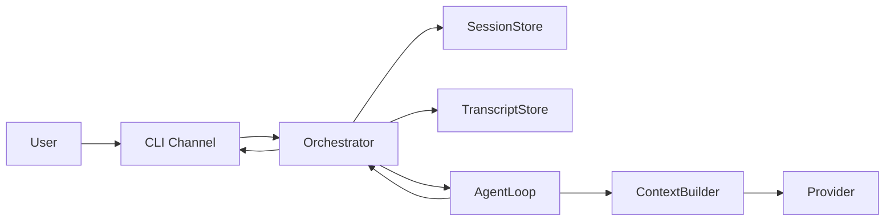

# Nexus

Nexus is an Elixir/OTP agent framework designed to be extensible, observable,
and easy to learn from while it is being built.

The project is currently in the first implementation phase:

- architecture and terminology are being stabilized
- a minimal end-to-end synchronous runtime path exists
- the next goal is the first real-provider smoke test

## Current Status

The repository currently includes:

- a bootable OTP application
- a passing test suite
- a minimal runtime path with:
  - `CLI Channel`
  - `Orchestrator`
  - `AgentLoop`
  - `ContextBuilder`
  - `FakeProvider`
  - in-memory `SessionStore`
  - in-memory `TranscriptStore`
- architecture notes and implementation plans
- project rules for step-by-step learning
- architecture diagrams for the current structure and flow

## Architecture At A Glance



## How One Turn Works

1. A channel normalizes external input into `Message.Inbound`.
2. The `Orchestrator` resolves or creates the session.
3. The inbound user message is persisted in the transcript.
4. The `AgentLoop` receives the current session transcript.
5. The `ContextBuilder` turns that transcript into `Message.LLM[]`.
6. The `Provider` generates assistant content.
7. The `Orchestrator` persists the new transcript messages and builds `Message.Outbound`.

## Run the Baseline

Use these commands from the project root:

```bash
mix test
mix run -e 'Application.ensure_all_started(:nexus) |> IO.inspect()'
iex -S mix
```

## Project Docs

The working architecture and plan live in:

- `docs/architecture-notes.md`
- `docs/architecture-diagrams.md`
- `docs/implementation-plan-simple.md`
- `docs/implementation-plan-v0.md`
- `docs/project-rules.md`

## Read This Next

If you want to understand the runtime step by step, read these in order:

1. `docs/architecture-diagrams.md`
2. `lib/nexus/orchestrator.ex`
3. `lib/nexus/agent_loop.ex`
4. `lib/nexus/context_builder.ex`
5. `lib/nexus/provider.ex`

## Near-Term Goal

The next implementation target is a minimal real-provider vertical slice,
and it will continue to be built slowly and explicitly:

- one small file at a time
- with explanations of purpose and structure
- with diagrams updated as the runtime evolves
- with manual verification after each meaningful step
