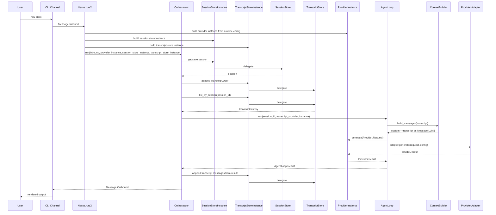
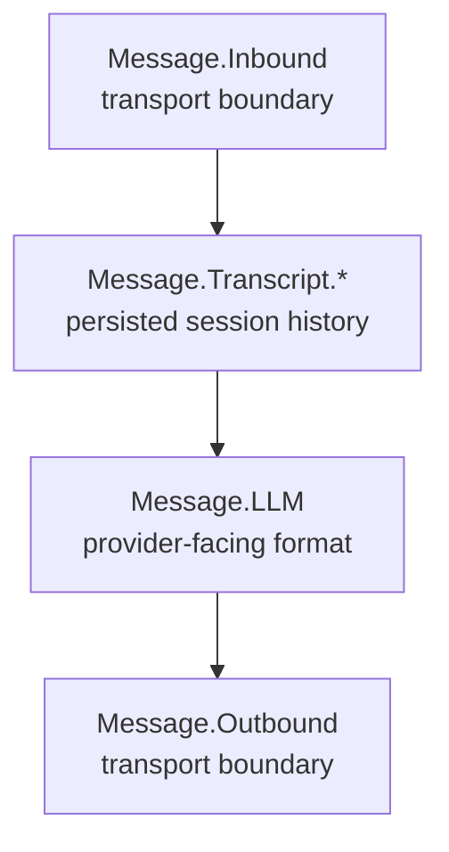

# Nexus Architecture Diagrams

This file exists to keep the project understandable as it evolves.

When the runtime changes in a meaningful way, this file should be updated so the
current structure and flow can be inspected quickly before reading code.

## Current Runtime Structure

```mermaid
flowchart LR
    User[User]
    CLI[CLI Channel]
    Runtime[Nexus.run/2]
    Inbound[Message.Inbound]
    Orchestrator[Orchestrator]
    SessionStoreInstance[SessionStoreInstance]
    TranscriptStoreInstance[TranscriptStoreInstance]
    SessionStore[SessionStore]
    TranscriptStore[TranscriptStore]
    ProviderInstance[ProviderInstance]
    AgentLoop[AgentLoop]
    ContextBuilder[ContextBuilder]
    SystemPrompt[priv/prompts/system.md]
    LLMMessages[Message.LLM[]]
    ProviderRequest[Provider.Request]
    Provider[Provider Adapter]
    ProviderResult[Provider.Result.Text<br/>or Provider.Result.ToolRequest]
    Result[AgentLoop.Result]
    Outbound[Message.Outbound]

    User --> CLI
    CLI --> Inbound
    Inbound --> Runtime
    Runtime --> SessionStoreInstance
    Runtime --> TranscriptStoreInstance
    Runtime --> ProviderInstance
    Runtime --> Orchestrator
    Orchestrator --> SessionStoreInstance
    Orchestrator --> TranscriptStoreInstance
    SessionStoreInstance --> SessionStore
    TranscriptStoreInstance --> TranscriptStore
    ProviderInstance --> Provider
    Orchestrator --> AgentLoop
    TranscriptStore --> AgentLoop
    AgentLoop --> ContextBuilder
    ContextBuilder --> SystemPrompt
    ContextBuilder --> LLMMessages
    LLMMessages --> ProviderRequest
    ProviderRequest --> Provider
    Provider --> ProviderResult
    ProviderResult --> ProviderInstance
    ProviderInstance --> AgentLoop
    AgentLoop --> Result
    Result --> Orchestrator
    Orchestrator --> Outbound
    Outbound --> CLI
```

## Current Single-Turn Flow



## Current Message Layers



## Current Responsibilities

- `Channel`
  normalizes external input into `Message.Inbound` and delivers `Message.Outbound`
- `Orchestrator`
  resolves the session, persists transcript boundaries, and coordinates one turn
- `Nexus.run/2`
  reads runtime config, builds provider/session/transcript store instances, and delegates to the orchestrator
- `RuntimeConfig`
  stays the public config facade and delegates source loading, section normalization, and tool loading to smaller helpers
- `ProviderInstance`
  wraps a provider adapter plus resolved config so the agent loop does not deal with setup concerns
- `SessionStoreInstance`
  wraps a session store adapter plus resolved config so the orchestrator does not know storage setup details
- `TranscriptStoreInstance`
  wraps a transcript store adapter plus resolved config so the orchestrator can persist transcript entries uniformly
- `ToolInstance`
  wraps one configured tool adapter and records whether it came from `system_tools` or runtime `tools`
- `AgentLoop`
  executes one turn against the provider and returns assistant output plus transcript items
- `ContextBuilder`
  turns persisted transcript into provider-facing `Message.LLM[]`
- `SessionStore`
  persists session snapshots
- `TranscriptStore`
  persists canonical session history
- `Provider`
  turns `Provider.Request` into `Provider.Result`
- `Tool`
  exposes a provider-facing definition plus executable behavior

## Current Limitations

- tools are configured and validated, but they are not yet executed by the agent loop
- `ContextBuilder` currently supports only transcript messages of type:
  - `Message.Transcript.User`
  - `Message.Transcript.Assistant`
- tool-related transcript messages are defined, but not yet consumed by the builder
- `OpenAICompatible` can already surface tool requests through `Provider.Result.ToolRequest`,
  but the current loop still rejects them explicitly
- the current provider path is still synchronous and non-streaming
- the default runtime config still uses in-memory stores and the fake provider

## Next Likely Step

The next planned implementation step is:

- wire the first real tool round into the agent loop
- then teach the transcript and context builder how to carry tool-related messages
