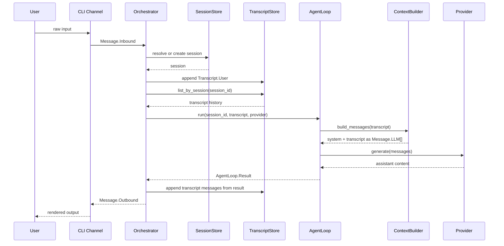
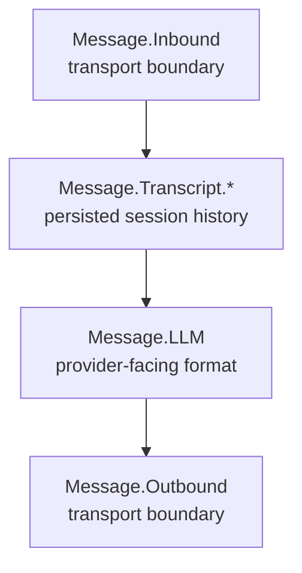

# Nexus Architecture Diagrams

This file exists to keep the project understandable as it evolves.

When the runtime changes in a meaningful way, this file should be updated so the
current structure and flow can be inspected quickly before reading code.

## Current Runtime Structure

```mermaid
flowchart LR
    User[User]
    CLI[CLI Channel]
    Inbound[Message.Inbound]
    Orchestrator[Orchestrator]
    SessionStore[SessionStore]
    TranscriptStore[TranscriptStore]
    AgentLoop[AgentLoop]
    ContextBuilder[ContextBuilder]
    SystemPrompt[priv/prompts/system.md]
    LLMMessages[Message.LLM[]]
    Provider[Provider]
    Result[AgentLoop.Result]
    Outbound[Message.Outbound]

    User --> CLI
    CLI --> Inbound
    Inbound --> Orchestrator
    Orchestrator --> SessionStore
    Orchestrator --> TranscriptStore
    Orchestrator --> AgentLoop
    TranscriptStore --> AgentLoop
    AgentLoop --> ContextBuilder
    ContextBuilder --> SystemPrompt
    ContextBuilder --> LLMMessages
    LLMMessages --> Provider
    Provider --> AgentLoop
    AgentLoop --> Result
    Result --> Orchestrator
    Orchestrator --> Outbound
    Outbound --> CLI
```

## Current Single-Turn Flow



## Current Message Layers



## Current Responsibilities

- `Channel`
  normalizes external input into `Message.Inbound` and delivers `Message.Outbound`
- `Orchestrator`
  resolves the session, persists transcript boundaries, and coordinates one turn
- `AgentLoop`
  executes one turn against the provider and returns assistant output plus transcript items
- `ContextBuilder`
  turns persisted transcript into provider-facing `Message.LLM[]`
- `SessionStore`
  persists session snapshots
- `TranscriptStore`
  persists canonical session history
- `Provider`
  turns `Message.LLM[]` into assistant content

## Current Limitations

- `ContextBuilder` currently supports only transcript messages of type:
  - `Message.Transcript.User`
  - `Message.Transcript.Assistant`
- tool-related transcript messages are defined, but not yet consumed by the builder
- the current provider path is still synchronous and non-streaming

## Next Likely Step

The next planned implementation step is:

- add a minimal real provider adapter and run the first smoke test with a real LLM

That should happen after this documentation rhythm improvement, not before.
